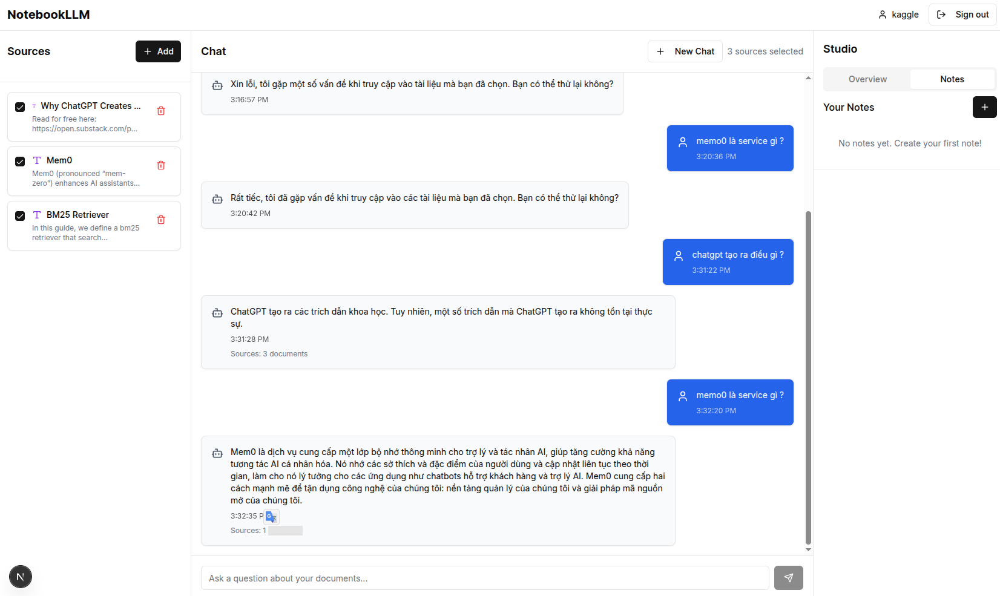

# NotebookLLM Clone

[](https://vercel.com/ngocp-0847s-projects/v0-notebookllm)
[](https://nextjs.org/)
[](https://www.typescriptlang.org/)
[](https://supabase.com/)

Một ứng dụng AI-powered để phân tích tài liệu và chat tương tác, được xây dựng với Next.js 15, TypeScript và Supabase. Cho phép người dùng upload tài liệu, xử lý chúng bằng embeddings, và có những cuộc trò chuyện thông minh về nội dung tài liệu.



## ✨ Tính năng chính

- 📄 **Upload và xử lý tài liệu**: Hỗ trợ nhiều định dạng file
- 🤖 **AI Chat Interface**: Trò chuyện thông minh về nội dung tài liệu 
- 🔍 **Vector Search**: Tìm kiếm ngữ nghĩa trong tài liệu với pgvector
- 📝 **Note Studio**: Tạo và quản lý ghi chú
- 🔐 **Authentication**: Hệ thống đăng nhập/đăng ký an toàn
- 📱 **Responsive Design**: Giao diện thân thiện trên mọi thiết bị
- 🎨 **Modern UI**: Sử dụng Shadcn/ui và Tailwind CSS

## 🛠️ Tech Stack

### Frontend
- **Framework**: Next.js 15 với App Router
- **Language**: TypeScript
- **UI Library**: Shadcn/ui components + Radix UI
- **Styling**: Tailwind CSS
- **Icons**: Lucide React
- **State Management**: React hooks và context

### Backend & Database
- **Database**: Supabase (PostgreSQL)
- **Vector Database**: Supabase pgvector cho embeddings
- **Authentication**: Custom auth với Supabase
- **API**: Next.js API Routes

### AI & ML
- **AI Provider**: OpenAI API
- **Embeddings**: text-embedding-ada-002
- **Chat Completions**: GPT models
- **Document Processing**: LangChain

## 🚀 Cài đặt và chạy local

### Yêu cầu hệ thống
- Node.js 18+ 
- pnpm (khuyến nghị) hoặc npm
- Supabase account
- OpenAI API key

### 1. Clone repository
```bash
git clone <repository-url>
cd notebookllm
```

### 2. Cài đặt dependencies
```bash
pnpm install
# hoặc
npm install
```

### 3. Cấu hình environment variables

Tạo file `.env.local` trong thư mục root:

```env
# Supabase Configuration
NEXT_PUBLIC_SUPABASE_URL=your_supabase_project_url
NEXT_PUBLIC_SUPABASE_ANON_KEY=your_supabase_anon_key
SUPABASE_SERVICE_ROLE_KEY=your_supabase_service_role_key

# OpenAI Configuration  
OPENAI_API_KEY=your_openai_api_key

# NextAuth Configuration (optional)
NEXTAUTH_SECRET=your_nextauth_secret
NEXTAUTH_URL=http://localhost:3000
```

### 4. Thiết lập Supabase Database

Chạy các script SQL trong thư mục `scripts/` theo thứ tự:

```bash
# Trong Supabase SQL Editor, chạy lần lượt:
# 001-create-tables.sql
# 002-create-match-function.sql  
# 003-update-match-function.sql
# 004-add-password-to-profiles.sql
# 005-seed-test-profiles.sql (optional - tạo test data)
```

### 5. Kích hoạt pgvector extension

Trong Supabase Dashboard:
1. Vào **Database** → **Extensions** 
2. Tìm và enable **vector** extension

### 6. Chạy ứng dụng
```bash
pnpm dev
# hoặc
npm run dev
```

Mở [http://localhost:3000](http://localhost:3000) trong browser.

## 📁 Cấu trúc project

```
├── app/                    # Next.js App Router
│   ├── api/               # API routes
│   │   ├── auth/         # Authentication endpoints
│   │   ├── chat/         # Chat completion endpoints
│   │   ├── documents/    # Document CRUD operations
│   │   ├── notes/        # Notes management
│   │   └── sources/      # Source management
│   ├── auth/             # Auth pages
│   ├── debug/            # Debug utilities
│   ├── login/            # Login page
│   └── register/         # Registration page
├── components/            # React components
│   ├── ui/               # Shadcn/ui components
│   ├── auth-panel.tsx    # Authentication UI
│   ├── chat-panel.tsx    # Chat interface
│   ├── dashboard.tsx     # Main dashboard
│   ├── notebook-interface.tsx  # Main interface
│   ├── sources-panel.tsx # Document management
│   └── studio-panel.tsx  # Note creation
├── lib/                  # Utility functions
│   ├── database.ts       # Database service class
│   ├── langchain.ts      # Vector service & LangChain
│   ├── supabase.ts       # Supabase client
│   ├── text-splitter.ts  # Document chunking
│   └── utils.ts          # Helper functions
├── hooks/                # Custom React hooks
├── types/                # TypeScript definitions
├── scripts/              # Database migration scripts
└── styles/               # Global styles
```

## 🗄️ Database Schema

### Bảng chính:
- **`profiles`**: Thông tin người dùng
- **`sources`**: Metadata tài liệu đã upload
- **`document_embeddings`**: Vector embeddings của chunks
- **`chat_sessions`**: Phiên chat
- **`notes`**: Ghi chú của người dùng

## 🔧 API Endpoints

### Authentication
- `POST /api/auth/register` - Đăng ký tài khoản
- `POST /api/auth/login` - Đăng nhập
- `POST /api/auth/logout` - Đăng xuất
- `GET /api/auth/me` - Lấy thông tin user

### Documents
- `GET /api/sources` - Lấy danh sách tài liệu
- `POST /api/sources` - Upload tài liệu mới
- `DELETE /api/documents/[id]` - Xóa tài liệu
- `POST /api/documents/process` - Xử lý và tạo embeddings

### Chat
- `POST /api/chat` - Gửi tin nhắn chat
- `GET /api/chat/sessions` - Lấy danh sách phiên chat
- `POST /api/chat/sessions` - Tạo phiên chat mới

### Notes
- `GET /api/notes` - Lấy danh sách ghi chú
- `POST /api/notes` - Tạo ghi chú mới
- `PUT /api/notes/[id]` - Cập nhật ghi chú
- `DELETE /api/notes/[id]` - Xóa ghi chú

## 🏗️ Luồng xử lý chính

### Upload & Process Document
1. User upload file qua Sources Panel
2. File được lưu trữ và metadata được tạo
3. Document được chia thành chunks (1000 chars, overlap 200)
4. Tạo embeddings cho từng chunk bằng OpenAI
5. Lưu embeddings vào Supabase với pgvector

### AI Chat Flow  
1. User gửi câu hỏi
2. Tìm kiếm chunks liên quan bằng vector similarity
3. Gửi context + câu hỏi tới OpenAI
4. Stream response về client
5. Lưu conversation vào database

## 🎨 UI/UX Guidelines

- Sử dụng Shadcn/ui components nhất quán
- Implement loading states appropriately  
- Hiển thị error messages rõ ràng cho user
- Responsive design cho mobile/desktop
- Accessibility standards (WCAG)
- Dark/Light theme support

## 🔒 Security

- Input validation cho tất cả user inputs
- Authentication checks cho protected routes
- Data sanitization trước khi lưu DB
- Environment variables cho sensitive data
- CORS configuration phù hợp

## 🚀 Deployment

### Vercel (Recommended)
1. Connect GitHub repository tới Vercel
2. Cấu hình environment variables
3. Deploy automatically với mỗi push

### Environment Variables cho Production
```env
NEXT_PUBLIC_SUPABASE_URL=your_production_supabase_url
NEXT_PUBLIC_SUPABASE_ANON_KEY=your_production_anon_key  
SUPABASE_SERVICE_ROLE_KEY=your_production_service_role_key
OPENAI_API_KEY=your_openai_api_key
NEXTAUTH_SECRET=your_strong_production_secret
NEXTAUTH_URL=https://your-domain.com
```

## 🐛 Debug & Troubleshooting

### Debug Page
Truy cập `/debug` để kiểm tra:
- Environment variables
- Database connection
- Authentication flow

### Common Issues
1. **Environment variables missing**: Kiểm tra `.env.local`
2. **Database connection failed**: Verify Supabase credentials
3. **OpenAI API errors**: Check API key và quota
4. **Vector search not working**: Ensure pgvector extension enabled

## 🤝 Contributing

1. Fork the repository
2. Tạo feature branch (`git checkout -b feature/amazing-feature`)
3. Commit changes (`git commit -m 'Add amazing feature'`)
4. Push to branch (`git push origin feature/amazing-feature`)
5. Tạo Pull Request

## 📝 License

[MIT License](LICENSE)

## 🙏 Acknowledgments

- [NotebookLM](https://notebooklm.google.com/) - Inspiration
- [Shadcn/ui](https://ui.shadcn.com/) - UI Components
- [Supabase](https://supabase.com/) - Backend & Database
- [OpenAI](https://openai.com/) - AI capabilities
- [LangChain](https://langchain.com/) - Document processing
