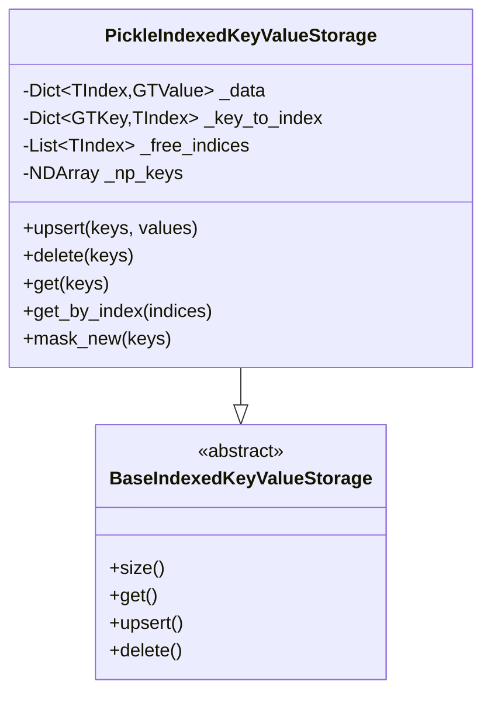
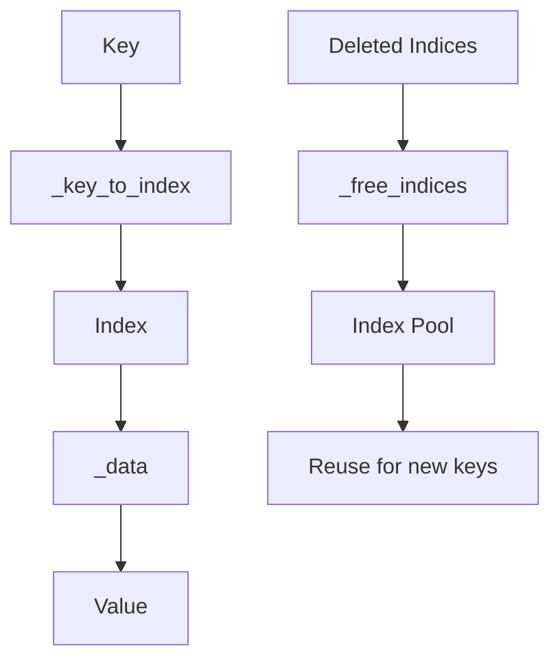
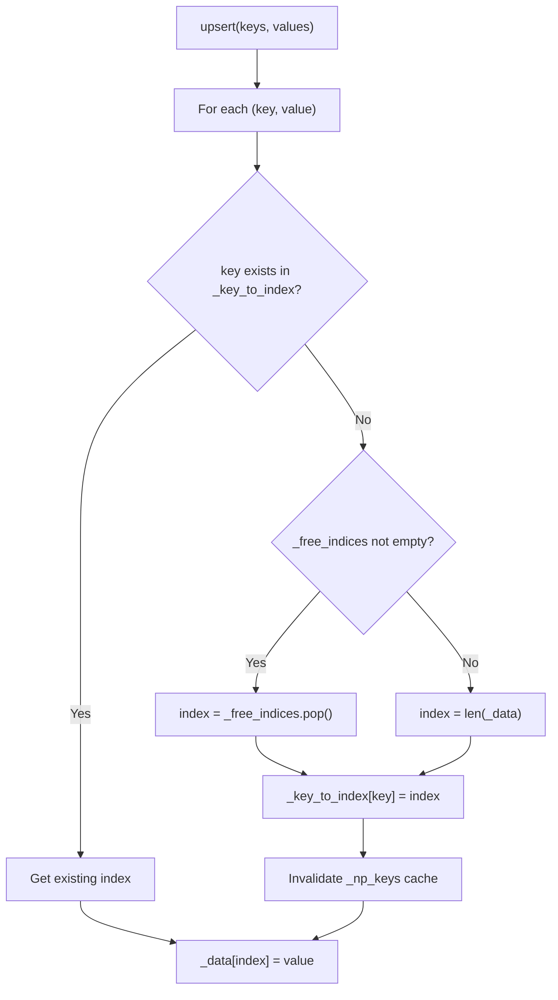
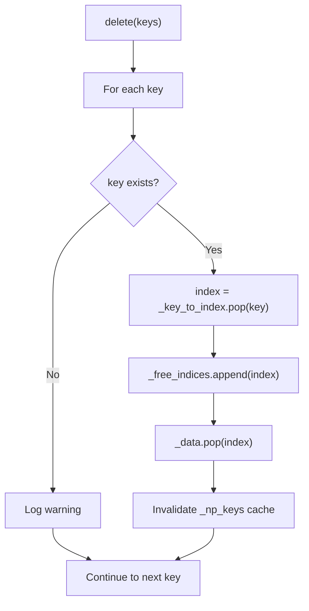
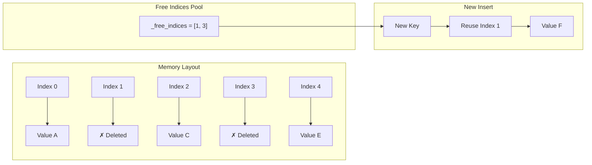
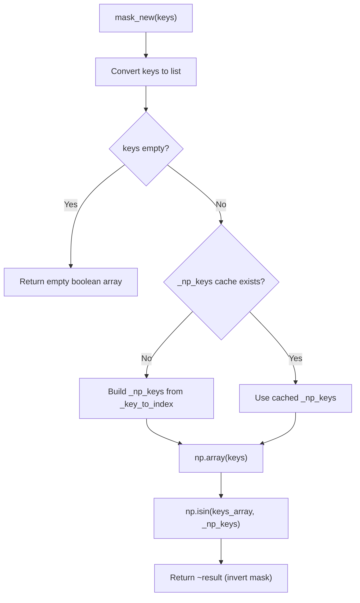
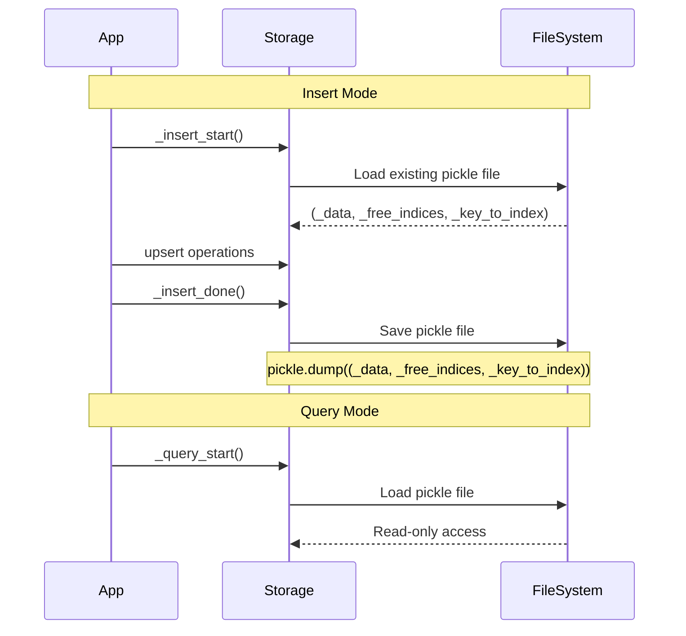
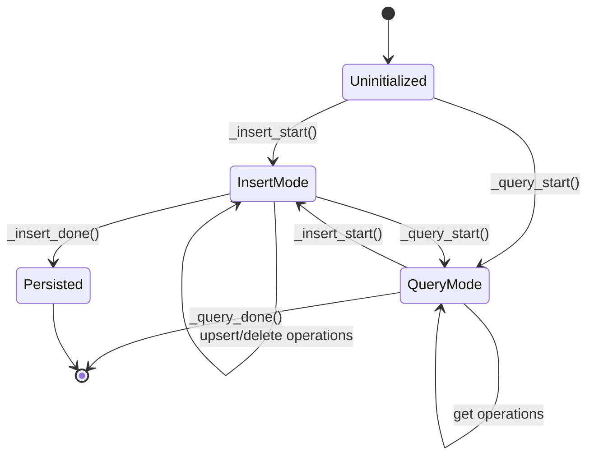
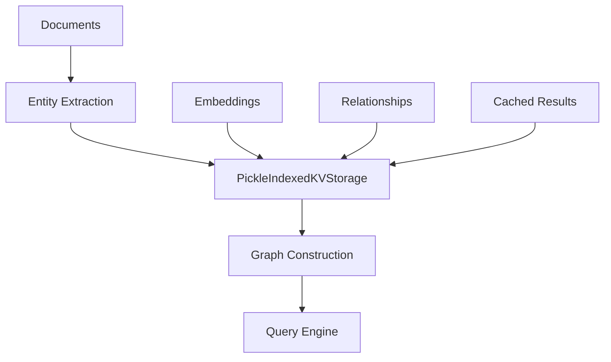

# Pickle Indexed Key-Value Storage Algorithm

## Tổng quan

File `_ikv_pickle.py` triển khai một cấu trúc dữ liệu **Indexed Key-Value Storage** với khả năng quản lý bộ nhớ thông minh. Đây là một hệ thống lưu trữ phân tán sử dụng **free indices pool** để tối ưu hóa việc sử dụng bộ nhớ và tăng hiệu suất truy cập.

## Kiến trúc thuật toán

### 1. Cấu trúc dữ liệu chính

### 2. Các thành phần chính

#### a) Mapping Structure
- **`_data`**: Ánh xạ từ chỉ số (index) đến giá trị
- **`_key_to_index`**: Ánh xạ từ key đến chỉ số
- **`_free_indices`**: Pool các chỉ số đã bị xóa, có thể tái sử dụng
- **`_np_keys`**: Cache numpy array để tối ưu operations

## Thuật toán chính

### 1. Upsert Operation

Thuật toán chèn/cập nhật với độ phức tạp **O(1)** trung bình:

**Công thức toán học:**

Độ phức tạp thời gian trung bình:
$$T_{upsert}(n) = O(1) \text{ per operation}$$

Độ phức tạp không gian:
$$S(n) = O(n) + O(f) + O(k)$$

Trong đó:
- $n$: số lượng elements trong `_data`
- $f$: số lượng free indices trong pool
- $k$: số lượng unique keys

### 2. Delete Operation

**Tính chất quan trọng:**
- Indices bị xóa được thêm vào `_free_indices` để tái sử dụng
- Không có memory fragmentation
- Cache invalidation đảm bảo consistency

### 3. Memory Management với Free Indices Pool

**Lợi ích của Free Indices Pool:**

1. **Memory Efficiency**: Tái sử dụng không gian đã giải phóng
2. **Cache Locality**: Indices không tăng vô tận
3. **Fragmentation Prevention**: Không có lỗ hổng trong memory layout

### 4. Mask New Algorithm

Thuật toán kiểm tra keys mới với **vectorized operations**:

**Công thức toán học:**

Cho tập keys đầu vào $K = \{k_1, k_2, ..., k_m\}$ và tập existing keys $E = \{e_1, e_2, ..., e_n\}$:

$$\text{mask}[i] = \begin{cases} 
\text{True} & \text{if } k_i \notin E \\
\text{False} & \text{if } k_i \in E 
\end{cases}$$

Độ phức tạp: $O(m + n)$ với numpy vectorization

## Persistence & Serialization

### 1. Pickle Serialization Strategy

### 2. State Transitions

## Tối ưu hóa hiệu suất

### 1. Cache Strategy

**Numpy Keys Cache (`_np_keys`)**:
- Lazy loading: chỉ build khi cần thiết
- Invalidation: xóa cache khi có thay đổi structure
- Vectorized operations: tăng speed cho batch operations

**Công thức hiệu suất:**

Without cache: $O(m \times n)$ comparisons  
With cache: $O(m + n)$ với numpy vectorization

$$\text{Speedup} = \frac{m \times n}{m + n} \approx \frac{mn}{n} = m \text{ (when } m \ll n\text{)}$$

### 2. Space Complexity Analysis

**Memory Usage:**
- `_data`: $O(n)$ where $n$ = số elements hiện tại
- `_key_to_index`: $O(k)$ where $k$ = số unique keys
- `_free_indices`: $O(f)$ where $f$ = số deleted indices
- `_np_keys`: $O(k)$ cache

**Total Space**: $S = O(n + k + f) = O(n)$ (since $k \leq n$ và $f \leq n$)

### 3. Time Complexity Summary

| Operation | Average Case | Worst Case | Space |
|-----------|-------------|------------|-------|
| `upsert` | $O(1)$ | $O(1)$ | $O(1)$ |
| `delete` | $O(1)$ | $O(1)$ | $O(1)$ |
| `get` | $O(1)$ | $O(1)$ | $O(1)$ |
| `mask_new` | $O(m + n)$ | $O(m + n)$ | $O(m)$ |
| `size` | $O(1)$ | $O(1)$ | $O(1)$ |

## Ứng dụng trong GraphRAG

Trong hệ thống GraphRAG, storage này được sử dụng để:

1. **Entity Storage**: Lưu trữ các entities được extract từ documents
2. **Relationship Mapping**: Ánh xạ relationships giữa các entities  
3. **Embedding Cache**: Cache các vector embeddings đã compute
4. **Query Results**: Lưu trữ kết quả queries để tái sử dụng

## Best Practices

1. **Batch Operations**: Sử dụng batch upsert thay vì single operations
2. **Cache Management**: Để cache invalidation tự động xử lý
3. **Memory Monitoring**: Monitor size của `_free_indices` pool
4. **Persistence Strategy**: Thường xuyên persist data trong insert mode

---

*Thuật toán này đặc biệt hiệu quả cho workloads có pattern insert/delete/query frequency cao với yêu cầu persistence và memory efficiency.*
