# Tài Liệu Kiến Trúc Phần Mềm - Fast GraphRAG

## 1. Tổng Quan Hệ Thống

Fast GraphRAG là một hệ thống Graph-based Retrieval-Augmented Generation được thiết kế để xử lý và truy vấn thông tin từ tài liệu thông qua việc xây dựng knowledge graph. Hệ thống tích hợp thuật toán trích xuất thực thể, vector embedding và graph reasoning để cung cấp khả năng trả lời câu hỏi chính xác và có ngữ cảnh.

### 1.1 Mục Tiêu Thiết Kế

- **Khả năng mở rộng**: Hỗ trợ multiple storage backends (Qdrant, Redis, Neo4j)
- **Hiệu suất cao**: Xử lý bất đồng bộ với throttling và batching
- **Linh hoạt**: Generic type system cho tùy chỉnh entity/relation types
- **Tích hợp AI**: Seamless integration với LLM services (OpenAI, custom)

## 2. Kiến Trúc Tổng Thể

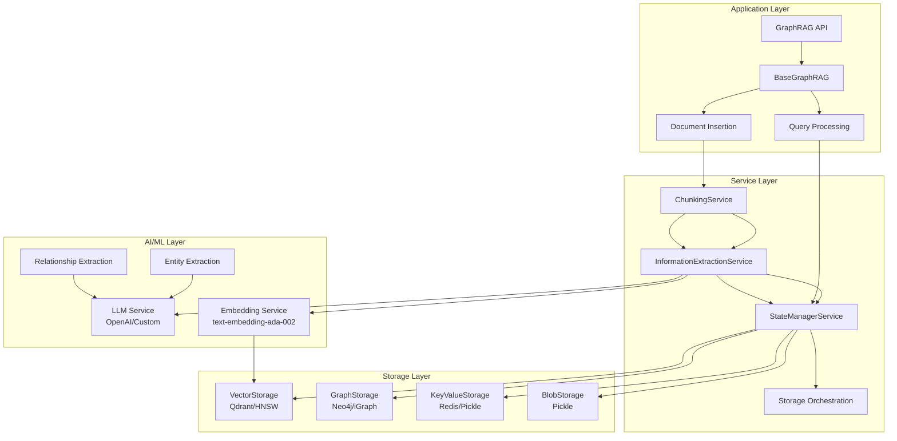

## 3. Kiến Trúc Chi Tiết Các Thành Phần

### 3.1 Type System Architecture

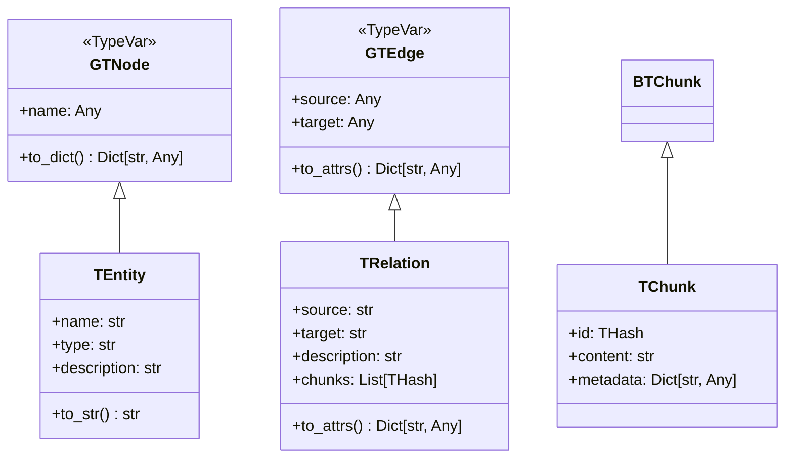

### 3.2 Service Layer Architecture

#### 3.2.1 Chunking Service

**Thuật toán Text Splitting:**

Sử dụng hierarchical text splitting với overlap:

```
Text → Split by separators → Merge with overlap → Extract chunks
```

**Công thức toán học:**

Cho một văn bản T có độ dài n, chunk size s, overlap o:
- Số chunk ≈ ⌈(n-o)/(s-o)⌉
- Chunk i: [i×(s-o), i×(s-o)+s]
- Overlap region: [i×(s-o), i×(s-o)+o]

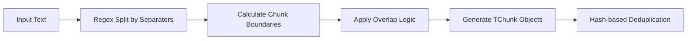

#### 3.2.2 Information Extraction Service

**Thuật toán Entity-Relationship Extraction:**

```mermaid
sequenceDiagram
    participant IE as InfoExtraction
    participant LLM as LLM Service
    participant G as Graph Storage
    
    IE->>LLM: Extract entities,relations from chunk
    LLM-->>IE: Initial graph
    
    loop Gleaning Process (max_steps)
        IE->>LLM: Refine extraction
        LLM-->>IE: Updated graph
        alt Status done
            break
        end
    end
    
    IE->>G: Merge graphs
    G-->>IE: Final knowledge graph
```

**Công thức Gleaning:**

Gleaning score = Σ(entity_confidence × relation_confidence) / total_entities

Dừng khi: gleaning_score > threshold hoặc steps > max_gleaning_steps

#### 3.2.3 State Manager Service

**Thuật toán Vector Similarity Search:**

```math
similarity(q, e_i) = \frac{q \cdot e_i}{||q|| \cdot ||e_i||}
```

Trong đó:
- q: query embedding vector
- e_i: entity embedding vector i
- Cosine similarity được sử dụng

**Graph-based Entity Scoring:**

```math
score_{final}(e_i) = \alpha \cdot score_{vector}(e_i) + \beta \cdot score_{graph}(e_i)
```

Với:
- α, β: weight parameters
- score_vector: cosine similarity score
- score_graph: PageRank-based score

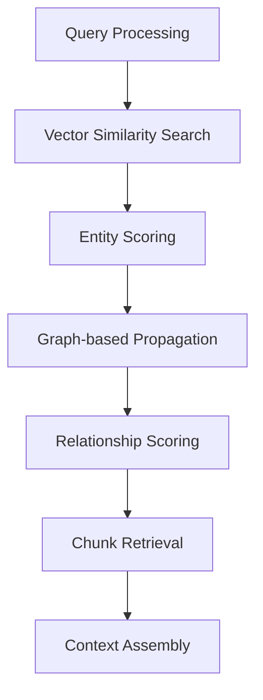

## 4. Storage Layer Architecture

### 4.1 Multi-Backend Storage Strategy

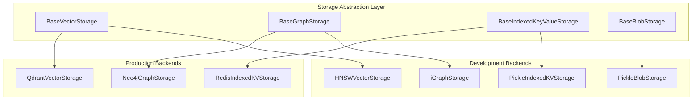

### 4.2 Vector Storage Implementation (Qdrant)

**Thuật toán Upsert với Batch Processing:**

```python
def batch_upsert(vectors, batch_size=100):
    for i in range(0, len(vectors), batch_size):
        batch = vectors[i:i+batch_size]
        qdrant_client.upsert(batch)
```

**Vector Search Algorithm:**

```math
\text{Search}(q, k, \tau) = \{v_i \mid similarity(q, v_i) \geq \tau\}_{top-k}
```

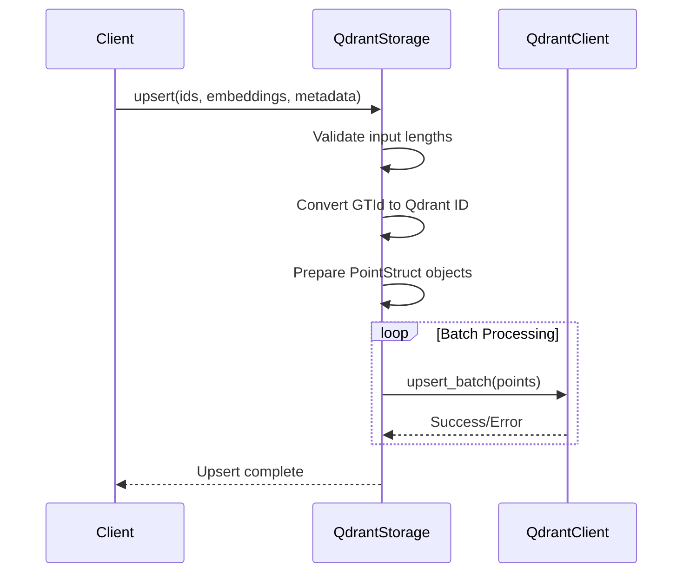

### 4.3 Graph Storage Implementation (Neo4j)

**PageRank Algorithm cho Node Scoring:**

```math
PR(n) = \frac{1-d}{N} + d \sum_{m \in M(n)} \frac{PR(m)}{L(m)}
```

Trong đó:
- d: damping factor (0.85)
- N: total number of nodes
- M(n): set of nodes linking to n
- L(m): number of outbound links from m

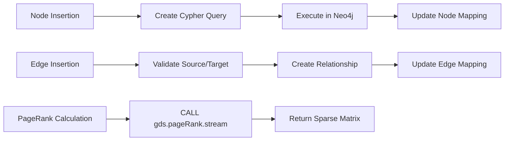

## 5. Query Processing Pipeline

### 5.1 Multi-stage Query Processing

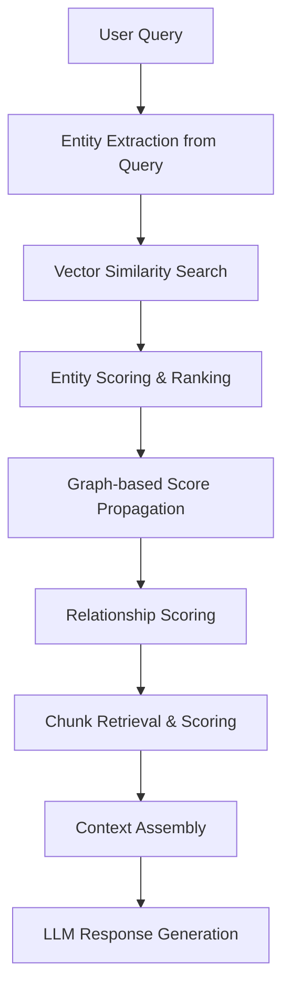

### 5.2 Context Assembly Algorithm

**Token Budget Management:**

```math
\begin{align}
Budget_{total} &= entities_{max} + relations_{max} + chunks_{max} \\
entities_{selected} &= \{e_i \mid score(e_i) \geq \tau_e\}_{top-k_e} \\
relations_{selected} &= \{r_j \mid score(r_j) \geq \tau_r\}_{top-k_r} \\
chunks_{selected} &= \{c_k \mid score(c_k) \geq \tau_c\}_{top-k_c}
\end{align}
```

**Context Ranking Formula:**

```math
score_{context}(item) = w_1 \cdot score_{relevance} + w_2 \cdot score_{diversity} + w_3 \cdot score_{freshness}
```

## 6. Concurrency & Performance Architecture

### 6.1 Async Processing với Throttling

```python
@throttle_async_func_call(max_concurrent=2048, stagger_time=0.001)
async def process_chunk(chunk):
    # Processing logic
    pass
```

**Semaphore-based Concurrency Control:**

```math
Throughput = \min\left(\frac{N_{workers}}{T_{avg}}, Rate_{limit}\right)
```

### 6.2 Memory Management Strategy

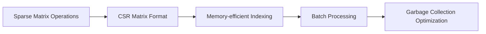

## 7. Error Handling & Resilience

### 7.1 Storage Error Recovery

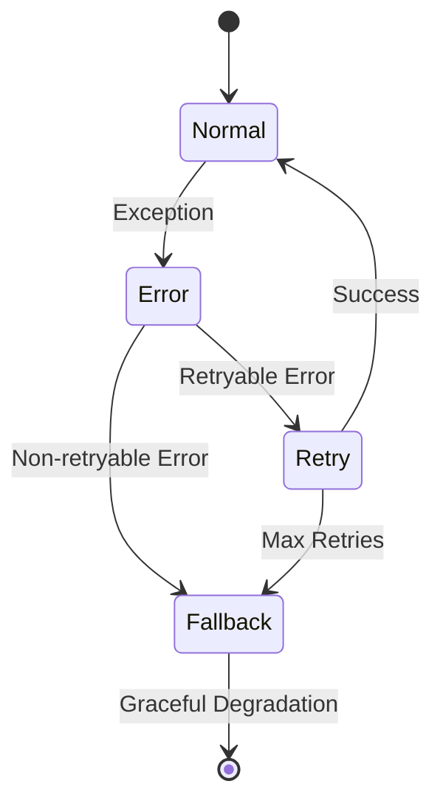

### 7.2 Data Consistency Strategy

**ACID Properties cho Graph Operations:**

- **Atomicity**: Batch operations với transaction support
- **Consistency**: Schema validation cho entities/relations
- **Isolation**: Read-after-write consistency
- **Durability**: Persistent storage với backup mechanisms

## 8. Metrics & Monitoring

### 8.1 Performance Metrics

```math
\begin{align}
Precision &= \frac{TP}{TP + FP} \\
Recall &= \frac{TP}{TP + FN} \\
F1 &= \frac{2 \cdot Precision \cdot Recall}{Precision + Recall} \\
Latency_{p95} &= \text{95th percentile of response times}
\end{align}
```

### 8.2 System Health Monitoring

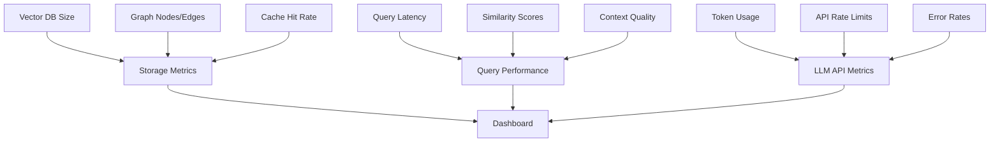

## 9. Deployment Architecture

### 9.1 Production Deployment

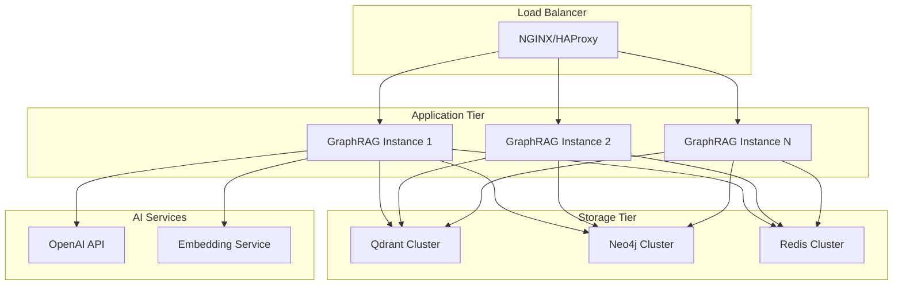

## 10. Tối Ưu Hóa & Tuning

### 10.1 Vector Search Optimization

**HNSW Parameters Tuning:**

```math
\begin{align}
M &= \text{max connections per node} \\
ef_{construction} &= \text{size of dynamic candidate list} \\
ef_{search} &= \text{size of search candidate list} \\
\text{Recall} &\propto ef_{search} \\
\text{Build Time} &\propto ef_{construction}
\end{align}
```

### 10.2 Graph Traversal Optimization

**Personalized PageRank với Restart Probability:**

```math
PR_{\text{personalized}}(n) = \alpha \cdot \text{restart\_prob} + (1-\alpha) \sum_{m \in M(n)} \frac{PR_{\text{personalized}}(m)}{L(m)}
```

## 11. Security Considerations

### 11.1 Data Privacy & Security

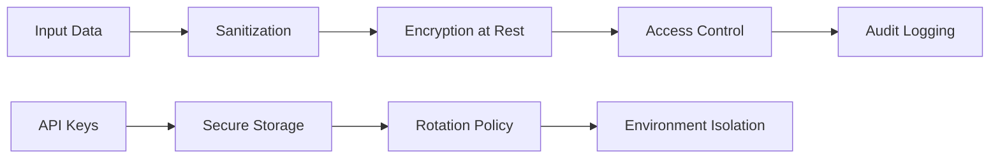

### 11.2 LLM Security

- **Prompt Injection Prevention**
- **Output Sanitization**
- **Rate Limiting per User**
- **Content Filtering**

## 12. Kết Luận

Fast GraphRAG cung cấp một kiến trúc scalable và flexible cho việc xây dựng knowledge graph từ documents và thực hiện intelligent querying. Hệ thống được thiết kế với:

- **Modularity**: Component-based architecture
- **Extensibility**: Plugin-based storage backends
- **Performance**: Async processing với intelligent caching
- **Reliability**: Comprehensive error handling và monitoring

Kiến trúc này cho phép hệ thống xử lý large-scale document collections while maintaining query performance và accuracy cao thông qua việc kết hợp vector similarity search với graph-based reasoning.
